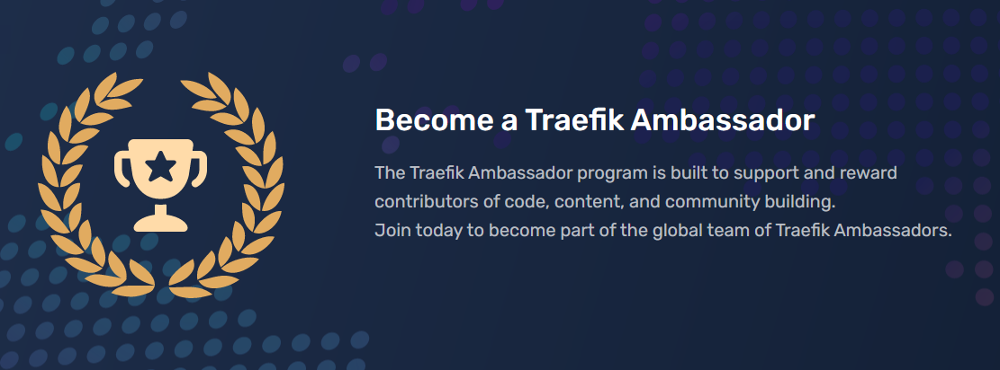

# The Traefik Ambassador Program

## What It Is & Why Join

Traefik Ambassadors are contributors of code, content, and community who get rewarded for their efforts. When you contribute, you’re invited to join a select group of people who receive swag, promotion of your contributions, and _very importantly_, you will gain access to the private Traefik Ambassador server, which offers collaborative opportunities and special private events. 

Here are ways to contribute. When you notify us of your contributions, we get started with rewarding and promoting your efforts right away! 

* Community Contributed Content. Submit your blog to community@traefik.io, and we’ll invite you to the program upon receipt
* Contributing Code. Submit your PRs, and projects which use Traefik Proxy, Traefik Mesh, and Traefik Enterprise to community@traefik.io, and we’ll invite you to the program upon receipt
* Contributing to the Community. Let us know if you’re presenting at a Meetup or conference about Traefik Labs software, and we’ll invite you to join the program and promote your sessions right away!

## Traefik Ambassador Posts 👑

Traefik Ambassador posts are focused on featuring content written with the dedicated support of the Traefik Community Team. These posts tell a valuable story and are shared on [traefik.io](https://www.traefik.io), promoted across our social media channels, and in the monthly newsletter.

Here are some examples:

* [Install And Configure Traefik with Helm by Containeroo](https://traefik.io/blog/install-and-configure-traefik-with-helm/)
* [Traefik 2.3: Towards Plugins and Beyond!](https://traefik.io/blog/traefik-plugins-pilot/)
* [Do Machines Learn? Testing in Production with Traefik](https://traefik.io/blog/do-machines-learn-testing-in-production-with-traefik/)

Email community@traefik.io if you would like to submit your idea for a post. 

Join the team of Traefik Ambassadors, and enjoy the benefits of being part of the dynamic, supportive, global community. Visit the [Community Page](https://traefik.io/community/) to learn about other ways to get involved! 
